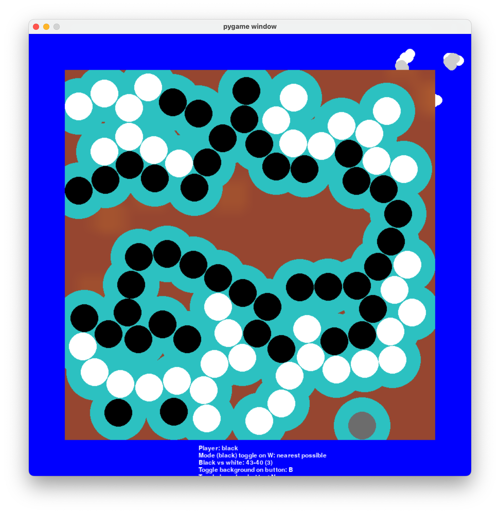

## Continuous GO


```sh
python main.py
```
rules:
1. Don't talk about go club
1.
1.

TODO:
* border padding for placement mask
* indicate group formed (before placement and after)
* more snapping regimes
* 