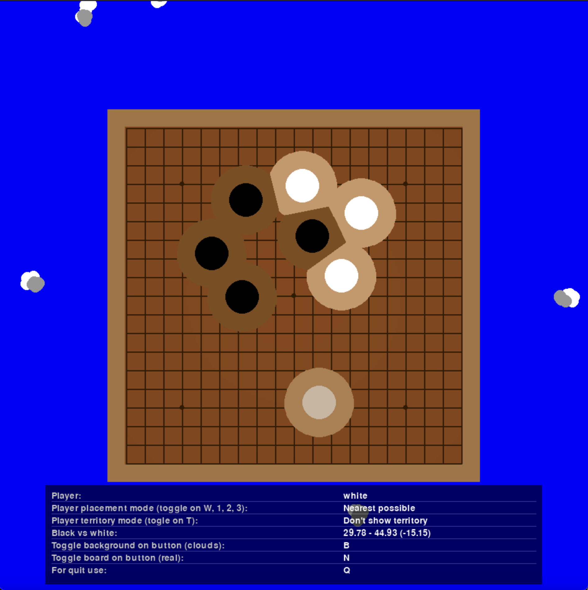
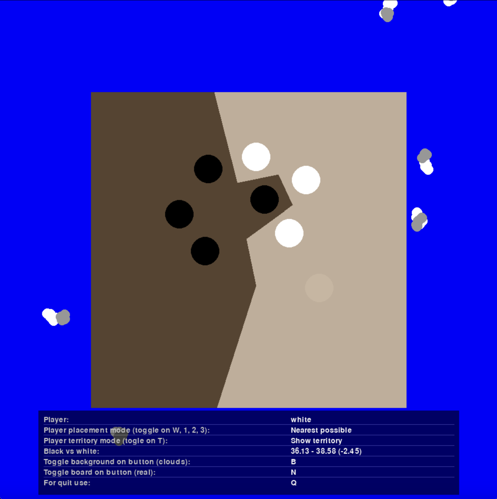
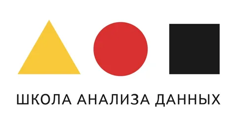

# GoYSDA: Реализации НЕПРЕРЫВНОЙ игры Го 

Добро пожаловать в GoYSDA — современную реализацию древней игры Го, написанную на Python с использованием `pygame`. Этот проект представляет собой уникальный взгляд на классическую игру, используя геометрические вычисления вместо традиционной сеточной логики.

Классический режим


Режим подсчета очков



## Управление

*   **Левая кнопка мыши:** Поставить камень.
*   **W / 1, 2, 3:** Сменить режим размещения камня.
*   **T:** Включить/выключить режим отображения территорий.
*   **B:** Сменить фон.
*   **N:** Сменить вид доски.
*   **Q:** Выйти из игры. 

## Особенности

*   **Геометрический движок:** Вместо сетки 19x19, игра использует непрерывное пространство. Захват групп и подсчет территории реализованы с помощью геометрических алгоритмов и диаграмм Вороного.
*   **Динамическая оценка территории:** Наблюдайте, как меняется баланс сил в реальном времени! Территория каждого игрока постоянно пересчитывается и отображается на экране.
*   **Различные режимы "прилипания" камней:**
    *   **Ближайшая точка (Nearest possible):** Классическое размещение камня в свободном месте.
    *   **К своему цвету (Snap to my color):** Позволяет ставить камни вплотную к своим, создавая плотные группы.
    *   **К цвету противника (Snap to opponent color):** Помогает ставить камни для атаки и окружения.
    *   *Переключение режимов: клавиша `W` или `1`, `2`, `3`.*
*   **Кастомизация внешнего вида:**
    *   **Переключение фона:** Выбирайте между анимированной водой и облаками. (Клавиша `B`)
    *   **Переключение вида доски:** Играйте на "реалистичной" или "прозрачной" доске. (Клавиша `N`)
*   **Визуализация территорий:** Включите специальный режим, чтобы наглядно увидеть, какие области доски контролирует каждый игрок. (Клавиша `T`)

---

## Установка и запуск

Проект был протестирован на **Python 3.12**.

1.  **Клонируйте репозиторий:**
    ```bash
    git clone <URL вашего репозитория>
    cd <папка репозитория>
    ```

2.  **Создайте и активируйте виртуальное окружение:**
    ```bash
    python3 -m venv venv
    source venv/bin/activate  # Для Windows: venv\Scripts\activate
    ```

3.  **Установите зависимости:**
    ```bash
    pip install -r goysda/requirements.txt
    ```

4.  **Запустите игру:**
    ```bash
    python3 goysda/main.py
    ```

---

## Документация

Мы подготовили подробную документацию, чтобы вы могли глубже понять, как устроен проект и как в него играть.

*   **[Правила Игры Го](./docs/GAME_RULES.md):** Если вы не знакомы с Го, начните отсюда. Здесь изложены основные правила и цели игры.

*   **[Структура Проекта](./docs/STRUCTURES.md):** Описание того, как организован код, и за что отвечает каждый файл.

*   **[Как Реализованы Правила](./docs/HOW_DO_RULES.md):** Техническое погружение в код. Узнайте, как реализованы захват камней и подсчет очков с помощью геометрического подхода.

## P.s. 

Игра была начата как шалость в выходные в стенах московского ШАДа :DD

